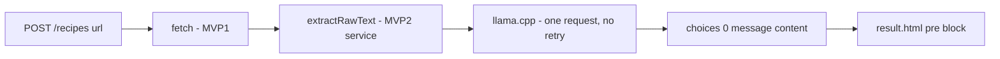

# MVP 3 Solution Design: Display Result in Web Application

## Requirement source

Implements `docs/requirements/mvp/3_display-result-webapp.md` only.

## Objective

Wire the existing fetch → LLM pipeline into a visible end-to-end result: submit a URL, get the raw LLM text back in a `<pre>` block. No JSON parsing, no schema validation, no retries.

## What changes

| Location | Change |
|---|---|
| `LlamaClient` | Add `buildSimpleRequest(model, systemMsg, userMsg)` — no `response_format`, no schema |
| `RecipeExtractionService` | Add `extractRawText(...)` method — calls simple request, returns `choices[0].message.content` as `String`, no JSON parsing, no retries |
| `RecipeController` | Call `extractRawText`, put `rawLlmText` in model, return `"result"` on success |
| `result.html` | Replace structured recipe display with: source URL + `<pre>` block of raw LLM text |

Everything else (fetch pipeline, `LlamaClient.sendChatCompletion`, error codes, properties) is **unchanged**.

## Flow



## Method: `RecipeExtractionService.extractRawText`

```
String extractRawText(String finalUrl, String contentType, String title, String body)
  throws LlmExtractionException
```

Steps:
1. Reduce content with `RecipeContentReducer` (same as existing `extract()`).
2. Build system + user messages using `RecipeExtractionPrompt` constants.
3. Call `LlamaClient.buildSimpleRequest(model, systemMsg, userMsg)` — no `response_format`.
4. Send via `LlamaClient.sendChatCompletion(requestBody)` — **one attempt, no retry**.
5. Parse the llama.cpp response JSON and return `choices[0].message.content` as a plain `String`.
6. On any error, throw `LlmExtractionException` with appropriate `LlmErrorCode`.

## Method: `LlamaClient.buildSimpleRequest`

Same structure as `buildRequest` but omits the `response_format` block entirely. Static helper, ~10 lines.

## Controller change

```java
String rawText = new RecipeExtractionService(llmProps)
    .extractRawText(fetchResult.finalUrl(), fetchResult.contentType(), title, fetchResult.body());
model.addAttribute("rawLlmText", rawText);
model.addAttribute("submittedUrl", url.trim());
return "result";
```

Error handling stays the same — `LlmExtractionException` caught, message set as `llmError`, renders `index`.

## `result.html`

Replace the entire body content with:

```html
<a href="/">&larr; Submit another URL</a>
<p><strong>Source:</strong> <span th:text="${submittedUrl}"></span></p>
<h2>LLM Response</h2>
<pre th:text="${rawLlmText}"></pre>
```

No structured sections, no metadata table, no unusable-page logic.

## Testing plan

- `RecipeExtractionServiceTest`: add one test for `extractRawText` — given a mock llama.cpp response JSON, assert the returned string equals `choices[0].message.content`.
- Manual test: submit a real recipe URL, confirm raw LLM text appears in the `<pre>` block.

## What is intentionally NOT done

- No JSON parsing or schema validation (that is advanced requirement `3_verify-llm-result.md`).
- No LLM retry logic.
- No structured recipe display.
- No changes to fetch pipeline or existing `extract()` method.
