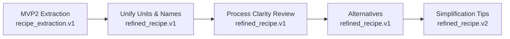

# Refine Recipe Definition — Multi-Step LLM Pipeline

## Objective

Chain specialised LLM prompts after MVP2 extraction. Each step receives JSON from the previous, applies one focused transformation, and outputs a new schema version.



## Pipeline steps

| Step | Prompt file | Input schema | Output schema | Purpose |
|------|------------|--------------|---------------|---------|
| 0 (existing) | `recipe_extraction_prompt.v1` | raw HTML/text | `recipe_extraction.v1` | Extract structured JSON from page content |
| 1 | `refine_unify_prompt.v1` | v1 | refined_recipe.v1 | Metric units + CH ingredient names |
| 2 | `refine_clarity_prompt.v1` | v1 | refined_recipe.v1 | Precise steps, explicit temps/times |
| 3 | `refine_alternatives_prompt.v1` | v1 | refined_recipe.v1 | Fallback ingredients per item |
| 4 (optional) | `refine_simplify_prompt.v1` | v1 | refined_recipe.v2 | Prep/cleanup tips & shortcuts |

Each step is a separate LLM call. Output JSON of one step becomes the user message input of the next. If status is `unusable`, skip the pipeline and return the error.

---

## Step 1 — Unify ingredients & units (metric + CH names)

**System prompt:** Normalise all quantities, units, and ingredient names to Swiss conventions.

- Convert weights → grams, volumes → ml/l. Conversion constants: 1 oz = 28 g, 1 lb = 454 g, 1 cup = 240 ml, 1 tsp = 5 ml, 1 tbsp = 15 ml.
- Quantities as decimals/whole numbers only — no fractions like "½".
- Map ingredient names to German CH common names when known (e.g., all-purpose flour → Mehl Type 550, baking powder → Backpulver, sour cream → Schmand). Keep original name in `note`.
- If no CH equivalent exists, keep original name but normalise quantity/unit to metric.
- Never invent quantities; preserve `originalText` unchanged.

**User message:** full `recipe_extraction.v1` JSON from Step 0.

**Output schema:** Same as input — only ingredient fields change (normalised `quantity`, `unit`, `name`).

---

## Step 2 — Review step & process clarity

**System prompt:** Ensure every instruction is precise, safe, and unambiguous for a home cook.

- **Temperatures:** Every oven reference must state temperature in °C IN THE STEP TEXT. Convert °F → °C if needed. If baking/roasting is implied but no temp stated, insert "Heizen Sie den Ofen auf <temp>°C vor."
- **Timing:** Every step with a duration states it explicitly (e.g., "backe für 20 Minuten"). Surface timer values in the `text` field; remove duplicate timer-only entries.
- **Sequencing:** Steps in correct chronological order. Merge naturally combined actions; split steps with multiple independent actions.
- **Clarity:** Replace vague instructions ("cook until done") with specific indicators (visual/tactile cues).
- **Safety:** Flag raw meat/egg steps by adding a note to the `notes` array.

**User message:** full refined JSON from Step 1.

**Output schema:** Same as input + new optional field: `"reviewNotes": ["...", "..."]`.

---

## Step 3 — Add alternative / fallback ingredients

**System prompt:** For each ingredient, suggest up to 2 practical alternatives available in Swiss/German grocery stores (Migros, Coop, Denner, Volg).

- Prioritise availability over perfection (e.g., "Sahne" → "Schmand + etwas Milch").
- Spices/exotic items: common substitute or note that omission is acceptable for small quantities (< 1 tsp).
- Skip basic staples and ingredients already marked as alternatives.

**User message:** full refined JSON from Step 2.

**Output schema:** Same as input, each ingredient gains optional `alternatives` field:

```json
"alternatives": [{"name": "...", "note": "..."}, ...]
```

---

## Step 4 — Simplification & prep/cleanup tips (optional)

**System prompt:** Suggest practical ways to reduce work. Categories:

1. **Prep shortcuts** — e.g., pre-cut veg, mince all aromatics at once
2. **Cleanup reductions** — e.g., line tray with parchment, one-bowl chopping
3. **Step mergers** — combine steps that don't risk outcome (e.g., chop while sauce simmers)
4. **Make-ahead** — components ready 1+ day ahead

Rules: specific and actionable (not generic "be organized"), reference concrete steps/ingredients, max 3 per category, total max 8.

**User message:** full refined JSON from Step 3.

**Output schema:** Schema version bumps to `refined_recipe.v2`. Adds top-level field:

```json
"simplificationTips": { "prepShortcuts": [...], "cleanupReductions": [...], "stepMergers": [...], "makeAhead": [...] }
```

---

## Error handling per step

| Scenario | Action |
|----------|--------|
| Output not valid JSON | Log error, return raw text + previous step output as fallback. |
| LLM timeout / unavailable | Stop pipeline. Return last valid output with `refinementStatus: "partial"`. |
| No changes from input | Continue — valid for well-formatted recipes. |
| Schema validation fails | Treat as refinement failure for that step; return prior validated output with warning note. |

---

## Implementation notes

### Service structure

```text
web/src/main/java/dev/recing/web/
  refined/
    RefinedRecipeService.java      // orchestrates the pipeline
    StepExecutor.java              // generic LLM caller + validator
    RefinementPipeline.java        // enum: UNIFY, CLARITY, ALTERNATIVES, SIMPLIFY
```

### Orchestration logic

1. Receive `LlmExtractionResult` from MVP2. Skip if status is `unusable`.
2. For each step in order (UNIFY → CLARITY → ALTERNATIVES → SIMPLIFY):
   - Build prompt: appropriate template + previous JSON output.
   - Call local LLM via existing `LlamaClient`.
   - Parse and validate response against expected schema.
   - Success → pass to next step. Failure/timeout → stop, return last valid output with `refinementStatus`.
3. Return final refined recipe + metadata on completed steps.

### Configuration

```properties
recing.refine.pipeline-steps=unify,clarity,alternatives,simplify
recing.refine.max-tokens-per-step=2048
recing.refine.timeout-seconds=120
recing.refine.temperature=0.3   # slightly creative for alternatives/simplify
```

### Testing plan

- `RefinedRecipeServiceTest`: feeds valid v1 extraction, verifies all 4 steps produce valid JSON in sequence.
- `StepExecutorTest`: validates schema mismatch handling and timeout fallback.
- Per-step integration tests with known input/output pairs (e.g., "2 cups flour" → quantity=480, unit="ml", name="Mehl Type 550").
- Manual test: full pipeline on 3–5 real recipe URLs; inspect intermediate outputs.

---

## Schema version summary

| Version | Added fields | Step |
|---------|-------------|------|
| `recipe_extraction.v1` | base extraction (ingredients, instructions, etc.) | MVP2 |
| `refined_recipe.v1` | `reviewNotes[]`; `alternatives[]` per ingredient | Steps 1–3 |
| `refined_recipe.v2` | `simplificationTips` object with 4 categories | Step 4 |

All versions are backward-compatible: later fields are optional. Consumers that only understand v1 simply ignore extra fields.
